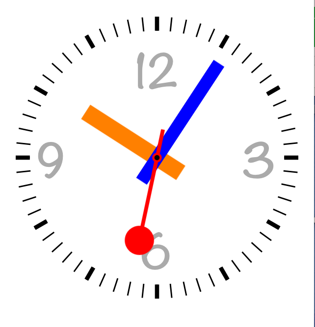

# BGClockView
Swift subclass of UIView that displays and functions as an analog clock with various clock faces with accompanying demo app.

# Recent Screenshots 
</img>
</img>
</img>
</img>

# Installation
Download sample app and copy files in BGClockView folder into your project.

(Side note: to get all of the features of the demo app you can add Weather Underground API key to WebServicesManager.swift `let kWUndergroundAPIKey = ""`)

# Use
BGClockView can be initialized either in Storyboard/Xib or through frames. Once initialized, BGClockView is customizable. 

```Swift
self.clockView.textColor = UIColor.lightGrayColor()
self.clockView.face = .Normal
self.clockView.hand = .Swiss
self.clockView.faceFont = UIFont(name: "Noteworthy-Bold", size: 14.0)!
self.clockView.minuteTickColor = UIColor.blackColor()
self.clockView.minuteHandColor = UIColor.blueColor()
self.clockView.hourHandColor = UIColor.orangeColor()
self.clockView.secondHandColor = UIColor.redColor()
self.clockView.screwColor = UIColor.blackColor()
self.clockView.timeZoneNameString = "Asia/Tokyo"
self.clockView.hideDateLabel = true
self.clockView.continuous = false
self.clockView.start()
```
Will produce this rather hideous clock.

</img>

# Features
###Clock faces
BGClockView has the following clock faces that are available through the face property:
```Swift
enum FaceStyle
{
    case Swiss
    case Normal
    case Simple
    case Utility
    case BigBen
    case Melting
    case Minimal
    case Plain
    case Square
    case Chrono
    case Flip
    case Zulu
}
```
###Hand styles
BGClockView has the following clock hands that are available through the hand property:
```Swift
enum HandStyle
{
    case Swiss
    case AppleWatch
    case Chrono
    case BigBen
    case Melting
    case Minimal
    case Plain
}
```
###Images
In addition you can replace the clock face and hands with prerendered images by setting the `clockFaceImage`,`hourHandImage`,`minuteHandImage`, and `secondHandImage` properties. For example:

```Swift
clockView.clockFaceImage = UIImage(named: "clockFace")
clockView.hourHandImage = UIImage(named: "hourHand")
clockView.minuteHandImage = UIImage(named: "minuteHand")
clockView.secondHandImage = UIImage(named: "secondHand")
```
###Time Zones
You can set a clock's time zone through the `timeZoneNameString`

###Static times
If you would like to use BGClockView to display a static time you can call `setClockToTime(day:Int,hour:Int,minute:Int,second:Int,weekday:Int)`
For example:
```Swift
self.clockView.setClockToTime(1, hour: 10, minute: 9, second: 30, weekday: 6)
```
Will set the clock to the Saturday, the 1st, 10:09:30 am.
If using autolayout, this method should be called after the layout engine has finished its passes e.g. `viewDidLayoutSubviews`
#Gotcha's
Some properties are overloaded. And some properties don't apply to all clock faces. You can use the demo app's customization tab to find these.

Also, **🙀 Please forgive the incredibly confusing code in some of the classes. This is my first Swift project and optional chaining and other Swift features could have been better used amoungst other things🙀**

#License
This project is licensed under The MIT License (MIT)
Copyright (c) 2016
